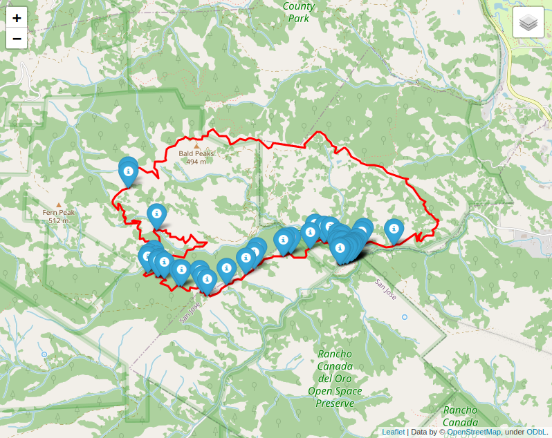

Usage
=====

At a low level, **inattrails** provides Python code to download named roads
and trails and also iNturalist observations along hiking trails.
This functionality may be used in other Python projects. They are described in
the :ref:`api` section.

At a higher level, :ref:`utility` reads the route of a hike and generates a
table of iNaturalist observations along the way. It also displays the
observations and the route of the hike on a map. It also stores waypoints of
the iNaturalist observations for offline navigation with a GPS device or
smartphone.

.. _installation:

Installation
------------

*inattrails* runs on Python 3.7 or higher and it can be installed with *pip*.

.. code-block:: console

   $ pip install inattrails

.. _utility:

Utility inattrails
------------------

Besides a Python package this is a command-line tool. It is called with a .gpx
file describing the route. This .gpx file can either be downloaded after a hike
from a gps device or smartphone or created before a hike by a mapping tool or
website. The gpx files in the
`examples directory <https://github.com/joergmlpts/iNat-trails/tree/master/examples>`_
have been created using the free website `caltopo.com <https://caltopo.com>`_.

This is an example where we first download one of gps tracks from *inattrail*'s
examples:

.. code-block:: console

   wget https://github.com/joergmlpts/iNat-trails/raw/master/examples/Rancho_Canada_del_Oro.gpx
   inattrails Rancho_Canada_del_Oro.gpx

The output looks like this:

.. code-block:: console

  Reading 'examples/Rancho_Canada_del_Oro.gpx'...
  Loaded 13 named roads and trails: Bald Peaks Trail, Canada Del Oro Cut-Off Trail, Canada Del Oro Trail, Casa Loma Road,
    Catamount Trail, Chisnantuk Peak Trail, Little Llagas Creek Trail, Llagas Creek Loop Trail, Longwall Canyon Trail,
    Mayfair Ranch Trail, Needlegrass Trail, Serpentine Loop Trail.
  Loaded 2,708 iNaturalist observations of quality-grade 'research' within bounding box.
  Excluded 1,694 observations not along route and 13 with low accuracy.
  Loaded 829 taxa.
  Waypoints written to './Rancho_Canada_del_Oro_Open_Space_Preserve_all_research_waypoints.gpx'.
  Table written to './Rancho_Canada_del_Oro_Open_Space_Preserve_all_research_observations.html'.
  Map written to './Rancho_Canada_del_Oro_Open_Space_Preserve_all_research_mapped_observations.html'.

This tool finds named trails along this route. It loads iNaturalist observations
from the area of the hike and discards those that are not along the trails. It
writes three output files, a waypoints file, a table of observations, and an
interactive map. Both the table and the map are displayed in the browser.

The waypoint file can be loaded into the free offline navigation app
`OsmAnd <https://osmand.net/>`_. This allows this offline navigation app to
display the iNaturalist observations along the hiking trails.

The interactive map shows the route and the iNaturalist observations along the
hike. Like the iNaturalist website, the markers on the interactive map have
different colors for different iconic taxa, e.g. markers for plants are green.
Hovering the mouse over a marker shows the identification, clicking on a marker
shows a thumbnail image, the identification, the observer, the date and a
special status such as invasive or introduced. Another click on the thumbnail
opens the observation on the iNaturalist website in another browser window.

The table of observations lists all the organisms that have been observed along
the trails together with the trail names where they were found. The table for
mammals seen in this park looks like this:

.. raw:: html

   <html>
   <table>
   <tr><td><u><b>Scientific Name</b></u></td><td><u><b>Common Name</b></u></td><td><u><b>Observations</b></u></td></tr>
   <tr><td></td><td></td><td></td><td></td></tr>
   <tr><td><b><i>Canidae</i></b></td><td><b>Canids</b></td><td></td></tr>
   <tr><td><i>Canis&nbsp;latrans</i></td><td>Coyote</td><td>Mayfair Ranch Trail: <a href="https://www.inaturalist.org/observations/38860133" target="_blank">38860133</a>, <a href="https://www.inaturalist.org/observations/38860889" target="_blank">38860889</a></td></tr>
   <tr><td><i>Urocyon&nbsp;cinereoargenteus</i></td><td>Gray Fox</td><td>Bald Peaks Trail: <a href="https://www.inaturalist.org/observations/169320230" target="_blank">169320230</a>, <a href="https://www.inaturalist.org/observations/169346468" target="_blank">169346468</a>; Mayfair Ranch Trail: <a href="https://www.inaturalist.org/observations/39391329" target="_blank">39391329</a>, <a href="https://www.inaturalist.org/observations/82367061" target="_blank">82367061</a>, <a href="https://www.inaturalist.org/observations/119805725" target="_blank">119805725</a></td></tr>
   <tr><td></td><td></td><td></td><td></td></tr>
   <tr><td><b><i>Cervidae</i></b></td><td><b>Deer</b></td><td></td></tr>
   <tr><td><i>Odocoileus&nbsp;hemionus</i></td><td>Mule Deer</td><td>Little Llagas Creek Trail: <a href="https://www.inaturalist.org/observations/97091190" target="_blank">97091190</a></td></tr>
   <tr><td></td><td></td><td></td><td></td></tr>
   <tr><td><b><i>Cricetidae</i></b></td><td><b>Hamsters, Voles, Lemmings, and Allies</b></td><td></td></tr>
   <tr><td><i>Neotoma&nbsp;fuscipes</i></td><td>Dusky-Footed Woodrat</td><td>Mayfair Ranch Trail: <a href="https://www.inaturalist.org/observations/52963985" target="_blank">52963985</a></td></tr>
   <tr><td></td><td></td><td></td><td></td></tr>
   <tr><td><b><i>Felidae</i></b></td><td><b>Felids</b></td><td></td></tr>
   <tr><td><i>Lynx&nbsp;rufus</i></td><td>Bobcat</td><td>Mayfair Ranch Trail: <a href="https://www.inaturalist.org/observations/15630740" target="_blank">15630740</a>, <a href="https://www.inaturalist.org/observations/15689757" target="_blank">15689757</a>, <a href="https://www.inaturalist.org/observations/38861135" target="_blank">38861135</a></td></tr>
   <tr><td></td><td></td><td></td><td></td></tr>
   <tr><td><b><i>Geomyidae</i></b></td><td><b>Pocket Gophers</b></td><td></td></tr>
   <tr><td><i>Thomomys&nbsp;bottae</i></td><td>Botta's Pocket Gopher</td><td>Mayfair Ranch Trail: <a href="https://www.inaturalist.org/observations/126903" target="_blank">126903</a>, <a href="https://www.inaturalist.org/observations/38869384" target="_blank">38869384</a>, <a href="https://www.inaturalist.org/observations/38875049" target="_blank">38875049</a>, <a href="https://www.inaturalist.org/observations/182278119" target="_blank">182278119</a></td></tr>
   <tr><td></td><td></td><td></td><td></td></tr>
   <tr><td><b><i>Leporidae</i></b></td><td><b>Hares and Rabbits</b></td><td></td></tr>
   <tr><td><i>Sylvilagus&nbsp;bachmani</i></td><td>Brush Rabbit</td><td>Mayfair Ranch Trail: <a href="https://www.inaturalist.org/observations/47200364" target="_blank">47200364</a>, <a href="https://www.inaturalist.org/observations/73152597" target="_blank">73152597</a>, <a href="https://www.inaturalist.org/observations/74462983" target="_blank">74462983</a>, <a href="https://www.inaturalist.org/observations/115787696" target="_blank">115787696</a>, <a href="https://www.inaturalist.org/observations/138449617" target="_blank">138449617</a>, <a href="https://www.inaturalist.org/observations/154909507" target="_blank">154909507</a>, <a href="https://www.inaturalist.org/observations/156000421" target="_blank">156000421</a>, <a href="https://www.inaturalist.org/observations/171638196" target="_blank">171638196</a>, <a href="https://www.inaturalist.org/observations/181314717" target="_blank">181314717</a></td></tr>
   <tr><td></td><td></td><td></td><td></td></tr>
   <tr><td><b><i>Sciuridae</i></b></td><td><b>Squirrels</b></td><td></td></tr>
   <tr><td><i>Neotamias&nbsp;merriami</i></td><td>Merriam's Chipmunk</td><td>Longwall Canyon Trail: <a href="https://www.inaturalist.org/observations/42605223" target="_blank">42605223</a>; Mayfair Ranch Trail: <a href="https://www.inaturalist.org/observations/132863" target="_blank">132863</a>, <a href="https://www.inaturalist.org/observations/15351304" target="_blank">15351304</a>, <a href="https://www.inaturalist.org/observations/46538314" target="_blank">46538314</a></td></tr>
   <tr><td><i>Otospermophilus&nbsp;beecheyi</i></td><td>California Ground Squirrel</td><td>Casa Loma Road: <a href="https://www.inaturalist.org/observations/47200360" target="_blank">47200360</a>; Llagas Creek Loop Trail: <a href="https://www.inaturalist.org/observations/152200928" target="_blank">152200928</a>; Mayfair Ranch Trail: <a href="https://www.inaturalist.org/observations/133882" target="_blank">133882</a>, <a href="https://www.inaturalist.org/observations/2328803" target="_blank">2328803</a>, <a href="https://www.inaturalist.org/observations/15629491" target="_blank">15629491</a>, <a href="https://www.inaturalist.org/observations/53667091" target="_blank">53667091</a>, <a href="https://www.inaturalist.org/observations/72054474" target="_blank">72054474</a>, <a href="https://www.inaturalist.org/observations/102356238" target="_blank">102356238</a>, <a href="https://www.inaturalist.org/observations/107205485" target="_blank">107205485</a>, <a href="https://www.inaturalist.org/observations/115031588" target="_blank">115031588</a>, <a href="https://www.inaturalist.org/observations/121910880" target="_blank">121910880</a>, <a href="https://www.inaturalist.org/observations/152201141" target="_blank">152201141</a>, <a href="https://www.inaturalist.org/observations/160174643" target="_blank">160174643</a>, <a href="https://www.inaturalist.org/observations/175808922" target="_blank">175808922</a></td></tr>
   <tr><td><i>Sciurus&nbsp;griseus</i></td><td>Western Gray Squirrel</td><td>Mayfair Ranch Trail: <a href="https://www.inaturalist.org/observations/73152599" target="_blank">73152599</a>, <a href="https://www.inaturalist.org/observations/182278583" target="_blank">182278583</a></td></tr>
   <tr><td></td><td></td><td></td><td></td></tr>
   <tr><td><b><i>Soricidae</i></b></td><td><b>Shrews</b></td><td></td></tr>
   <tr><td><i>Sorex&nbsp;vagrans</i></td><td>Vagrant Shrew</td><td>Mayfair Ranch Trail: <a href="https://www.inaturalist.org/observations/120889692" target="_blank">120889692</a></td></tr>
   </table>

   </html>

The numbers are the observation ids; clicking on them opens the observation on
the iNaturalist website. The `--login_names`  option can be used to replace
these observation ids with login names.

Command-line arguments
----------------------

This script is a command-line utility. It is called with options and filenames
as arguments. These options are supported:

.. code-block:: console

   $ inattrails -h
   usage: inattrails [-h] [--quality_grade QUALITY_GRADE] [--iconic_taxon ICONIC_TAXON] [--login_names] gpx_file [gpx_file ...]

   positional arguments:
     gpx_file              Load GPS track from .gpx file.

   optional arguments:
     -h, --help            show this help message and exit
     --quality_grade QUALITY_GRADE
                           Observation quality-grade, values: all, casual, needs_id, research; default research.
     --iconic_taxon ICONIC_TAXON
                           Iconic taxon, values: all, Actinopterygii, Amphibia, Animalia, Arachnida, Aves, Chromista,
                           Fungi, Insecta, Mammalia, Mollusca, Plantae, Protozoa, Reptilia; default all.
     --login_names         Show login name instead of numeric observation id in table of observations.
     --month               Show only observations from this month and the previous and next months.

quality_grade
  The *--quality_grade* option spcifies the desired quality-grade of the
  observations to be shown. By default, only research-grade observations are
  shown. Alternatively, all quality grades, or only casual and needs_id can be
  requested.

iconic_taxon
  The *--iconic_taxon* option allows to restrict the observations to an iconic
  taxon. This can be used to display observations of e.g. only birds or only
  plants.

login_names
  The *--login_names* option replaces the observation id number with the login
  name in the table of observations.

month
  The *--month* option restricts observations to the current month and the
  previous and next months. This is useful for seasonal observations such as
  wildflowers or migratory birds.
